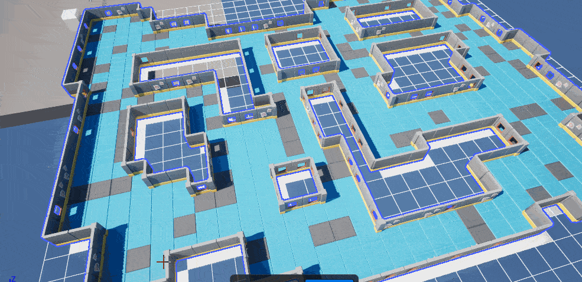
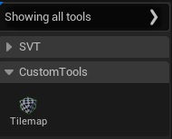
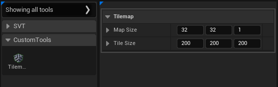
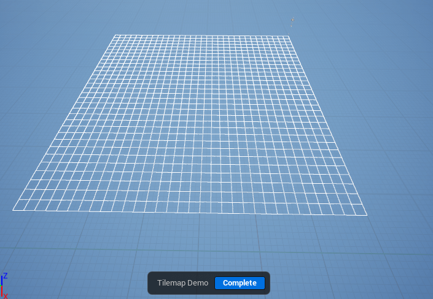
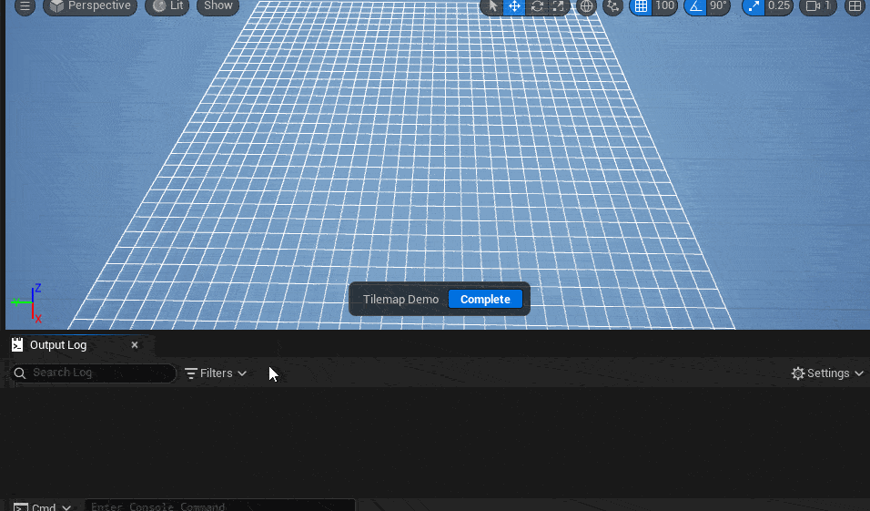
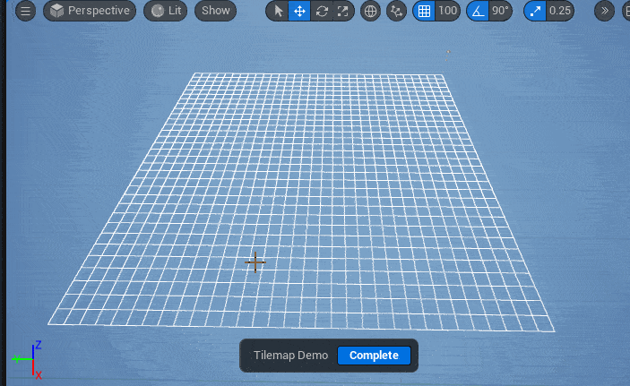
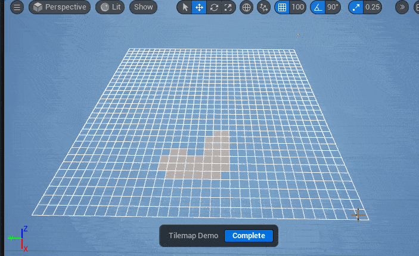

---
date:
  created: 2025-03-29
---

# My first Scriptable Tool - Tilemap Draw Tool

I was super excited when Scriptable Tools were introduced in the Unreal Engine 5. Back then, I was thinking "This can be used to create a Tilemap in 3D". I started working on it, but there weren't many resources that I can follow at that time.

In 2025, Unreal Engine youtube channel release a video introducing [Geometry Scripting and Scriptable Tools](https://www.youtube.com/watch?v=gNKVGbwfX4c), though when I watched it, there is no mention on Geometry Scripting :laughing:. But, the Scriptable Tool have a lot of new feature as I'm aware, and the blocker that I have before, now it can be solved! They've added awesome debugging tools like LineSet and TriangleSet! At the end of the video, they showcasing that the dungeon actually created with the help of the custom Scriptable Tools. But bummer - they didn't show how they built it :(.

So here we go, I've been working to create Tilemap Draw Tool similar to the showcase in the video and this is the result



## First step to create Custom Scriptable Tool

Before go into deep, I suggest you guys to [watch the video](https://www.youtube.com/watch?v=gNKVGbwfX4c) and read the official documentation to get started. This article more focus on how I create the tilemap tool.

### Create Settings class to store the configuration

Create a new C++ class, let's call it `UEditorTilemapPropertySet` to store the configuration.

```cpp
#pragma once

#include "CoreMinimal.h"
#include "EditorScriptableInteractiveTool.h"
#include "EditorTilemapPropertySet.generated.h"

UCLASS()
class DEMOEDITORTOOL_API UEditorTilemapPropertySet : public UEditorScriptableInteractiveToolPropertySet
{
	GENERATED_BODY()

public:
	UPROPERTY(EditAnywhere, BlueprintReadOnly, Category = "Tilemap")
	FIntVector MapSize {32, 32, 1};
	UPROPERTY(EditAnywhere, BlueprintReadOnly, Category = "Tilemap")
	FIntVector TileSize {200, 200, 200};
};
```

### Create the Scriptable Tool class

Scriptable Tool have 2 type, Editor and non-Editor. For this article, we will use the Editor one. Create a new class, let's call it `UEditorTilemapTool`

=== "Header"

	```cpp
	#pragma once

	#include "CoreMinimal.h"
	#include "BaseTools/EditorScriptableModularBehaviorTool.h"
	#include "EditorTilemapTool.generated.h"

	UCLASS(Transient, Blueprintable)
	class DEMOEDITORTOOL_API UEditorTilemapTool : public UEditorScriptableModularBehaviorTool
	{
		GENERATED_BODY()
	public:
		UEditorTilemapTool();
	}
	```

=== "Source"

	```cpp
	UEditorTilemapTool::UEditorTilemapTool()
	{
		// Setting up the tool information
		ToolName = FText::FromString(TEXT("Tilemap"));
		ToolLongName = FText::FromString(TEXT("Tilemap Designer"));
		bShowToolInEditor = true;
	}
	```

Basically, you've already create a new Custom Scriptable Tool called Tilemap, to verify this, you can compile and open the Scriptable Tool section, it will look like this



### Register Settings

We will utilize the `UEditorTilemapPropertySet` Settings that we've already created. This will shown in the Scriptable Tool section.

=== "Header"

	```cpp hl_lines="6-13"
	class DEMOEDITORTOOL_API USvtEditorTilemapTool : public UEditorScriptableModularBehaviorTool
	{
	public:
		UEditorTilemapTool();

		virtual void Setup() override;

		UPROPERTY()
		class UEditorTilemapPropertySet* Settings;

	protected:
		UFUNCTION()
		void HandlePropertyModified(UScriptableInteractiveToolPropertySet* PropertySet, FString PropertyName);
	```

=== "Source"

	```cpp
	#include "EditorTilemapPropertySet.h"

	void UEditorTilemapTool::Setup()
	{
		EToolsFrameworkOutcomePins OutResult;
		Settings = Cast<UEditorTilemapPropertySet>(AddPropertySetOfType(UEditorTilemapPropertySet::StaticClass(), TEXT("Settings"), OutResult));

		if (OutResult == EToolsFrameworkOutcomePins::Failure)
		{
			return;
		}

		RestorePropertySetSettings(Settings, TEXT("TilemapSettings"));

		FToolPropertyModifiedDelegate PropertyChangedDelegate;
		PropertyChangedDelegate.BindDynamic(this, &UEditorTilemapTool::HandlePropertyModified);

		WatchProperty(Settings, TEXT("TileSize"), PropertyChangedDelegate);
		WatchProperty(Settings, TEXT("MapSize"), PropertyChangedDelegate);
		WatchProperty(Settings, TEXT("TilemapDebugMaterial"), PropertyChangedDelegate);
	}

	void UEditorTilemapTool::HandlePropertyModified(UScriptableInteractiveToolPropertySet* PropertySet, FString PropertyName)
	{
		UEditorTilemapPropertySet* SettingProp = Cast<UEditorTilemapPropertySet>(PropertySet);

		if (SettingProp == nullptr)
		{
			return;
		}
		
		SavePropertySetSettings(SettingProp, TEXT("TilemapSettings"));
	}
	```

Let's breakdown the code above. 

1. `Setup()` was called when you start selecting the tool, in this case `Tilemap` tool. This function is the start point to initialize anything you need. 
2. As you can see, we start by calling `AddPropertySetOfType`, this will register our PropertySet to be used as Tilemap Settings. 
3. If everything goes well, we start to restore the property value (if any) by calling `RestorePropertySetSettings`. 
4. Don't forget to watch the property by calling `WatchProperty` and passing the delegate function, you need to call `SavePropertySetSettings` when the value changed, this will ensure the next time you activate the Tilemap tool, the property will restore correctly.



### Draw Grid

We will utilize the `UEditorTilemapTool::Render` to draw the grid. This function offer basic render such as line draw.

=== "Header"

	```cpp hl_lines="6"
	class DEMOEDITORTOOL_API USvtEditorTilemapTool : public UEditorScriptableModularBehaviorTool
	{
	public:
		...
		virtual void Setup() override;
		virtual void Render(IToolsContextRenderAPI* RenderAPI) override;
		...
	```

=== "Source"

	```cpp
	#include "ToolDataVisualizer.h"

	void UEditorTilemapTool::Render(IToolsContextRenderAPI* RenderAPI)
	{
		FToolDataVisualizer Renderer;
		Renderer.BeginFrame(RenderAPI);

		const FIntVector TileSize = Settings->TileSize;
		const int32 Depth = Settings->TileSize.X * Settings->MapSize.X;
		const int32 Width = Settings->TileSize.Y * Settings->MapSize.Y;
		// Draw grid
		for (int32 X = 0; X <= Settings->MapSize.X; X++)
		{
			Renderer.DrawLine(FVector(X * TileSize.X, 0, 0), FVector(X * TileSize.X, Width, 0), FLinearColor::White);
		}
		for (int32 Y = 0; Y <= Settings->MapSize.Y; Y++)
		{
			Renderer.DrawLine(FVector(0, Y * TileSize.Y, 0), FVector(Depth, Y * TileSize.Y, 0), FLinearColor::White);
		}

		Renderer.EndFrame();

		Super::Render(RenderAPI);
	}
	```

Don't worry if the math looks scary - it's just calculating where to draw lines between tiles! Here's what you'll see after this code



### Working with Tool Interactions

There is multiple interaction you can do with the Editor Behaviour Tool, for tilemap tool, you will need to utilize `AddClickDragBehavior`. This support click and drag input, so you can continue draw the tilemap with mouse down button.

=== "Header"

	```cpp
	private:
		UFUNCTION()
		FInputRayHit HandleBeginClickDragSequence(FInputDeviceRay PressPos, FScriptableToolModifierStates Modifiers, EScriptableToolMouseButton MouseButton);
	```

=== "Source"

	```cpp hl_lines="6-46"
	void UEditorTilemapTool::Setup()
	{
		...
		WatchProperty(Settings, TEXT("TilemapDebugMaterial"), PropertyChangedDelegate);

		FTestCanBeginClickDragSequenceDelegate BeginClickDragSequenceDelegate;
		BeginClickDragSequenceDelegate.BindDynamic(this, &UEditorTilemapTool::HandleBeginClickDragSequence);
		
		AddClickDragBehavior(
			BeginClickDragSequenceDelegate,
			FOnClickPressDelegate(),
			FOnClickDragDelegate(),
			FOnClickReleaseDelegate(),
			FOnTerminateDragSequenceDelegate(),
			FMouseBehaviorModiferCheckDelegate());
	}

	FVector UEditorTilemapTool::CalculateIntersection(const FVector& Origin, const FVector& Direction, int32 ZFloor)
	{
		FVector Intersection = FVector::Zero();
		
		if (FMath::IsNearlyZero(Direction.Z))
		{
			if (FMath::IsNearlyZero(Origin.Z, ZFloor))
			{
				Intersection = Origin;
			}
		}
		else
		{
			Intersection = Origin + Direction * ((ZFloor - Origin.Z) / Direction.Z);
		}
		return Intersection;
	}

	FInputRayHit UEditorTilemapTool::HandleBeginClickDragSequence(FInputDeviceRay PressPos,
		FScriptableToolModifierStates Modifiers, EScriptableToolMouseButton MouseButton)
	{
		if (MouseButton != EScriptableToolMouseButton::LeftButton)
		{
			return FInputRayHit();
		}

		FVector Intersection = CalculateIntersection(PressPos.WorldRay.Origin, PressPos.WorldRay.Direction, 0);
		return UScriptableToolsUtilityLibrary::MakeInputRayHit(FVector::Distance(Intersection, PressPos.WorldRay.Origin), nullptr);
	}
	```

Here's the deal with this code...

1. In the `Setup()` function, we add `AddClickDragBehavior` call to register the mouse input.
2. We also register a delegate and it will call `UEditorTilemapTool::HandleBeginClickDragSequence`. This function will determine if the input is valid or not by returning `FInputHitRay`.
3. We add a new function called `CalculateIntersection` to calculate the intersection coordinate from the mouse ray to `ZFloor == 0`.

Now, we have the intersection coordinate, we need to handle the `FOnClickPressDelegate, FOnClickDragDelegate`.

=== "Header"

	```cpp hl_lines="3-4"
		...
		FInputRayHit HandleBeginClickDragSequence(FInputDeviceRay PressPos, FScriptableToolModifierStates Modifiers, EScriptableToolMouseButton MouseButton);
		UFUNCTION()
		void HandleClick(FInputDeviceRay MousePos, FScriptableToolModifierStates Modifiers, EScriptableToolMouseButton MouseButton);
	```

=== "Source"

	```cpp hl_lines="5-9 13-14 20-42"
	void UEditorTilemapTool::Setup()
	{
		BeginClickDragSequenceDelegate.BindDynamic(this, &UEditorTilemapTool::HandleBeginClickDragSequence);
		
		FOnClickPressDelegate OnClickPressDelegate;
		OnClickPressDelegate.BindDynamic(this, &UEditorTilemapTool::HandleClick);

		FOnClickDragDelegate OnClickDragDelegate;
		OnClickDragDelegate.BindDynamic(this, &UEditorTilemapTool::HandleClick);
			
		AddClickDragBehavior(
			BeginClickDragSequenceDelegate,
			OnClickPressDelegate,
			OnClickDragDelegate,
			FOnClickReleaseDelegate(),
			FOnTerminateDragSequenceDelegate(),
			FMouseBehaviorModiferCheckDelegate());
	}

	void UEditorTilemapTool::HandleClick(FInputDeviceRay MousePos, FScriptableToolModifierStates Modifiers,
		EScriptableToolMouseButton MouseButton)
	{
		if (MouseButton != EScriptableToolMouseButton::LeftButton)
		{
			return;
		}
		
		FVector Intersection = CalculateIntersection(MousePos.WorldRay.Origin, MousePos.WorldRay.Direction, 0);
		FIntVector Coord{};
		Coord.X = Intersection.X / Settings->TileSize.X;
		Coord.Y = Intersection.Y / Settings->TileSize.Y;

		// Out of Bounds
		if (Coord.X < 0 || Coord.Y < 0
			|| Coord.X >= Settings->MapSize.X || Coord.Y >= Settings->MapSize.Y
			)
		{
			return;
		}

		UE_LOG(LogTemp, Log, TEXT("Tilemap Coord: %f, %f"), Intersection.X, Intersection.Y)
	}
	```

What this basically does is...

1. In `Setup` function, we add another delegate and it will call `UEditorTilemapTool::HandleClick` when user start press mouse left button and dragging it.
2. `UEditorTilemapTool::HandleClick` will calculate the intersection coordinate, and for testing, we will print out the coordinate to the Output Log.

Let see if our tools is working as expected, activate the Tilemap Demo tool and open the output log.



#### Draw Active Tiles

Now, that we are able interacting with the Level Editor, one thing that left is draw the active tiles. We will utilize the `UScriptableToolTriangleSet` to draw the Active Tiles.

=== "Header"

	```cpp hl_lines="7-8 15-21"
		...
		
		protected:
			UFUNCTION()
			void HandlePropertyModified(UScriptableInteractiveToolPropertySet* PropertySet, FString PropertyName);

			UPROPERTY(BlueprintReadOnly)
			TSet<FIntVector> TempActiveTiles;

		...
		private:
			...
			void HandleClick(FInputDeviceRay MousePos, FScriptableToolModifierStates Modifiers, EScriptableToolMouseButton MouseButton);
			
			UPROPERTY()
			UScriptableToolTriangleSet* TriangleSet = nullptr;
			
			UPROPERTY()
			TMap<FIntVector, class UScriptableToolQuad*> Quads;
			
			void DrawTile(const FIntVector& Coord);
	```

=== "Source"

	```cpp hl_lines="1-2 8 24-28 31-47"
	#include "Drawing/ScriptableToolTriangle.h"
	#include "Drawing/ScriptableToolTriangleSet.h"

	void UEditorTilemapTool::Setup()
	{
		...
		WatchProperty(Settings, TEXT("TilemapDebugMaterial"), PropertyChangedDelegate);
		TriangleSet = AddTriangleSet();
		...
	}

	void UEditorTilemapTool::HandleClick(FInputDeviceRay MousePos, FScriptableToolModifierStates Modifiers,
		EScriptableToolMouseButton MouseButton)
	{
		...
		// Out of Bounds
		if (Coord.X < 0 || Coord.Y < 0
			|| Coord.X >= Settings->MapSize.X || Coord.Y >= Settings->MapSize.Y
			)
		{
			return;
		}

		if (!TempActiveTiles.Contains(Coord))
		{
			TempActiveTiles.Add(Coord);
			DrawTile(Coord);
		}
	}
	
	void UEditorTilemapTool::DrawTile(const FIntVector& Coord)
	{
		if (Quads.Contains(Coord))
		{
			//Skip
			return;
		}
		FVector P1 = FVector(Coord.X * Settings->TileSize.X, Coord.Y * Settings->TileSize.Y, Coord.Z * Settings->TileSize.Z);
		FVector P2 = FVector(Coord.X * Settings->TileSize.X, (Coord.Y + 1) * Settings->TileSize.Y, Coord.Z * Settings->TileSize.Z);
		FVector P3 = FVector((Coord.X + 1) * Settings->TileSize.X, (Coord.Y + 1) * Settings->TileSize.Y, Coord.Z * Settings->TileSize.Z);
		FVector P4 = FVector((Coord.X + 1) * Settings->TileSize.X, Coord.Y * Settings->TileSize.Y, Coord.Z * Settings->TileSize.Z);

		UScriptableToolQuad* Quad = TriangleSet->AddQuad();
		Quad->SetQuadPoints(P1, P2, P3, P4);
		Quad->SetQuadNormals(FVector::UpVector, FVector::UpVector, FVector::UpVector, FVector::UpVector);
		Quads.Add(Coord, Quad);
	}
	```

!!! warning "Caching Active Tiles"

	Heads up! In this article, we only cache the active tiles in the `UEditorTilemapTool`. This is not real world use case!
	In a real project, you should save the active tiles into an Actor, UObject, or maybe DataAsset!

	The TempActiveTiles will be cleanup after pressing complete button.


Here's what's happening here:

1. We create a new variable call `TempActiveTiles`, this will store the active tiles. Since we save this to the Tool class, it will clean up right after the you've done using the tool.
2. We add `UScriptableToolTriangleSet* TriangleSet`, this have responsibilities to store the Quad that we've drawn.
3. In the `UEditorTilemapTool::HandleClick`, we need to be carefull to always check the `TempActiveTiles`, if it contains the `Coord`, we should ignore it to prevent double quad at the same coordinate.
	


Pretty neat, right?

#### Remove Active Tiles

Now we can add active tiles and draw the quad, but we don't have ability to remove active tiles. We will use Shift + Left Click to remove the active tile

```cpp title="Source" hl_lines="13-23"
	void UEditorTilemapTool::HandleClick(FInputDeviceRay MousePos, FScriptableToolModifierStates Modifiers,
		EScriptableToolMouseButton MouseButton)
	{
		...
		// Out of Bounds
		if (Coord.X < 0 || Coord.Y < 0
			|| Coord.X >= Settings->MapSize.X || Coord.Y >= Settings->MapSize.Y
			)
		{
			return;
		}
		
		if (!TempActiveTiles.Contains(Coord) && !Modifiers.bShiftDown)
		{
			TempActiveTiles.Add(Coord);
			DrawTile(Coord);
		}
		else if (TempActiveTiles.Contains(Coord) && Modifiers.bShiftDown)
		{
			TempActiveTiles.Remove(Coord);
			TriangleSet->RemoveQuad(*Quads.Find(Coord));
			Quads.Remove(Coord);
		}
	}
```



Hope this helps you create something awesome too!